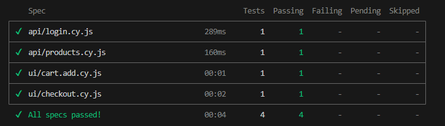
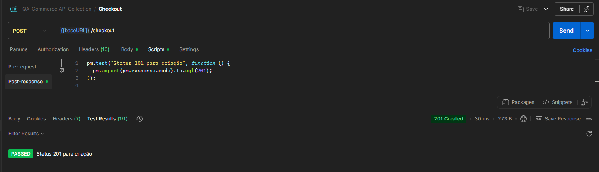

# QA-Commerce

### Loja virtual Geek para simulação de testes 

## Clonando e executando em sua máquina

### Pré-requisito:

-Node.js - Você encontra em: https://nodejs.org/en/
-Visual Studio Code ( ou editor de sua prefrência) - você encontra em: https://code.visualstudio.com/download
-Git: você encontra em: https://git-scm.com/downloads

Via terminal, rode os seguintes comandos:
```  
git clone https://github.com/fabioaraujoqa/qa-commerce.git
```
```
cd qa-commerce
```

#### Para instalar as dependencias:
```
npm install
```

#### Para subir o servidor e o banco:
```
npm start
```

No console vai aparecer os endereços do site e do banco. 
O site você acessaem: http://localhost:3000/

A documentação funciona em: http://localhost:3000/api-docs/

*Parceria: Fábio Araújo, Bruna Emerich e Tamara Fontanella


# Automação de Testes – Cypress

Os testes automatizados validam fluxos de API e UI da aplicação.

### Pré-requisitos adicionais

```
npm install -D cypress
```

---

### Executando os testes

#### Abrir interface do Cypress

```
npx cypress open
```

#### Rodar tudo em modo headless

```
npx cypress run
```

---

#### Testes executados com sucesso


---

# Testes de API

Foi adicionado á collection pre-existente do projeto (collection-pm.json) scripts de testes para validação de status code

Exemplo:


---

**Autora:** Jennifer Gabriely Pinto

---
